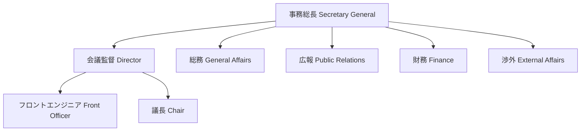

# 役職・組織紹介

AJMUN事務局は、多様なバックグラウンドを持つ学生によって構成されています。
各役職が専門性を発揮し、協力し合うことで、質の高い模擬国連大会の運営を実現しています。

## 組織図

## 各役職の概要

### [事務総長 (Secretary General)](./sec-gen)
事務局の最高責任者として、大会の理念策定や組織全体のマネジメントを行います。

### [会議監督 (Director)](./director)
会議の質の担保や、会議当日の進行管理、フロント官の統括を行います。

### [総務 (General Affairs)](./general-affairs)
参加者の募集管理、問い合わせ対応、当日のロジスティクスなど、大会の基盤を支えます。

### [広報 (Public Relations)](./public-relations)
SNS運用やウェブサイト管理、パンフレット作成などを通じて、大会の魅力を発信します。

### [財務 (Finance)](./financial)
予算策定や資金管理、助成金申請など、健全な財政運営を担います。

### [渉外 (External Affairs)](./external-affairs)
協賛企業の獲得や、他団体との連携交渉など、外部との窓口を担当します。
