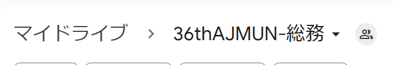

# 扱う情報

総務の仕事では、大会の参加者に関する様々な情報を集め、活用します。
本セクションでは情報の扱いに焦点をおいて解説します。

## 使用するサービス

以下のサービスを使用します。冒頭に任意とついているものは、使用しなくても問題はないです。

- スプレッドシート
  - VLOOKUP関数、QUERY関数などの関数を使用します
  - フィルタ、フィルタ表示などの機能を使用します
- Googleフォーム
  - 事務局員募集、会議監督募集、デリ募集(事務編・会議編)など幅広いタイミングで使用します
- Google Apps Script
  - Googleフォームの自動受付停止、Googleドライブのアクセス権監視などで使用します
- (任意)LookerStudio
  - アプライ状況の可視化、ホームページのアクセス分析に使用します

## 時系列

### 総務専用アカウントの作成

時期：24年1月頭

総務が動き出した直後、総務は専用のGoogleアカウントを作成しました。

代理店様とのメールのやり取り、各種ドライブの容量、引継ぎの利便性などを鑑みて、個人のGoogleアカウントとは別個のアカウントで運用しました。

※Googleドライブのデータ容量は結局のところ1GB程しか使用しませんでした。

Googleアカウントのログイン情報は、万が一のことを考えSGと総務ヒラには共有していました。

35thの場合はGmailの未読ラベルの有無によって対応しており、メールをやり取りする統括以外がGmailを開き未読ラベルを外してしまい、対応が遅れるというケースもありました。

36thではGASを用いて自動転送設定を入れていたので未読ラベルの問題は解消しています。

### 事務局員のメールアドレスを把握する

時期：24年1月頭~事務局員募集終了まで

[事務局員募集において収集する情報](/docs/soumu_docs/human-resources#%E4%BA%8B%E5%8B%99%E5%B1%80%E5%93%A1%E5%8B%9F%E9%9B%86%E3%81%8A%E3%81%84%E3%81%A6%E5%8F%8E%E9%9B%86%E3%81%99%E3%82%8B%E6%83%85%E5%A0%B1
)をGoogleフォームを用いて収集します。

このフォームの回答をスプレッドシートに同期させます。そのシートが後の「個人情報シート」になりました。

### 事務局内共有用のドライブの作成

時期：24年1月頭~事務局員募集終了まで

収集した事務局員のメールアドレスを用いて共有用ドライブを作成していきます。

作成した総務専用アカウントで[マイドライブ - Google ドライブ](https://drive.google.com/drive/my-drive)にアクセスし、「+ 新規」メニューから「新しいフォルダ」を選択し、「36thAJMUN-総務」とします。

キャプチャ内の人型のアイコンをクリックし、一般的なアクセスが制限付きになっていることを確認します。

「36thAJMUN-総務」フォルダは、他の役職のヒラを除いた全員に対して付与します(統括sと総務全員が見れるようにします)。
フォームで収集した項目のうち、対象になる人のメールアドレスをコピー＆ペーストして「編集者」として指定します。

これで、「36thAJMUN-総務」フォルダの作成は完了です。基本的にすべてのファイルはこのフォルダ下に入れておけば、URLのみで各統括・総務全員が見ることができるようになります。

作業後にフォームに回答のあった人のうち、総務フォルダを見ることができる人がいる場合は都度編集者に追加してあげましょう。

